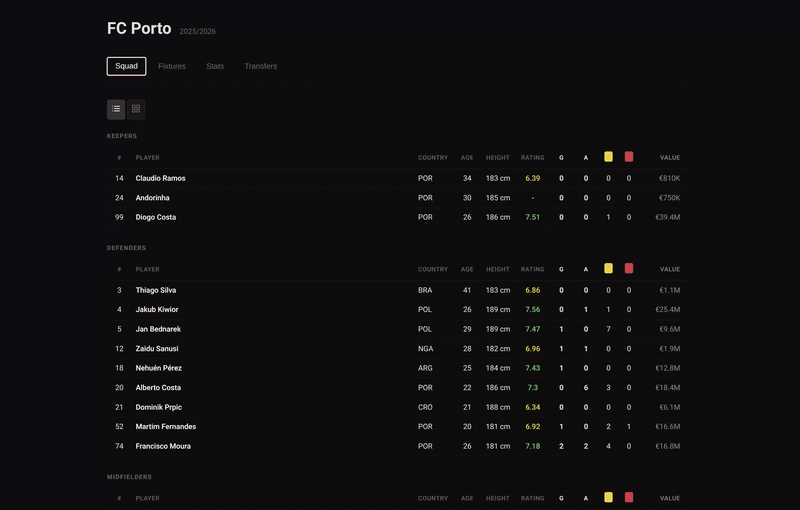

# FotMob Scraper

Scrapes team data from FotMob and exports it to CSV files, with a Svelte UI to explore squad, fixtures, stats, and transfers.

## Demo



## What It Scrapes

- Fixtures
- Squad
- Player stats
- Team info
- League table (when available)
- Transfers

All generated CSVs are written to `data/`.

## Project Structure

- `scraper/scraper.py`: main scraping/export script
- `scraper/config.py`: loads `.env` values
- `scraper/supabase_sync.py`: optional Supabase sync logic
- `supabase/schema.sql`: SQL schema for Supabase Query Editor
- `data/`: generated CSV output
- `client/`: Svelte + Vite frontend

## Requirements

- Python 3.10+
- Node.js 18+

## Setup

```bash
python3 -m venv .venv
source .venv/bin/activate
pip install -r requirements.txt
```

Create `.env`:

```bash
cp .env.example .env
```

Set your team:

```env
TEAM_ID=9773
```

Optional Supabase sync env vars:

```env
SUPABASE_URL=https://your-project-ref.supabase.co
SUPABASE_SERVICE_ROLE_KEY=your_service_role_key
SUPABASE_SCHEMA=public
```

## Run Scraper

```bash
python3 scraper/scraper.py
```

Optional: sync to Supabase in the same run:

```bash
python3 scraper/scraper.py --sync-supabase
```

Expected outputs:

- `data/fixtures.csv`
- `data/squad.csv`
- `data/player_stats.csv`
- `data/team_info.csv`
- `data/league_table.csv` (may be empty depending on response)
- `data/transfers.csv`

## Run Frontend

```bash
cd client
npm install
npm run dev
```

Open `http://localhost:5173`.

## Supabase Schema

Run `supabase/schema.sql` in Supabase Query Editor before using `--sync-supabase`.
Default schema used by the scraper is `public`.

## Dependencies

- [`mobfot`](https://pypi.org/project/mobfot/)
- `pandas`
- `python-dotenv`
- `supabase`
- Svelte + Vite
